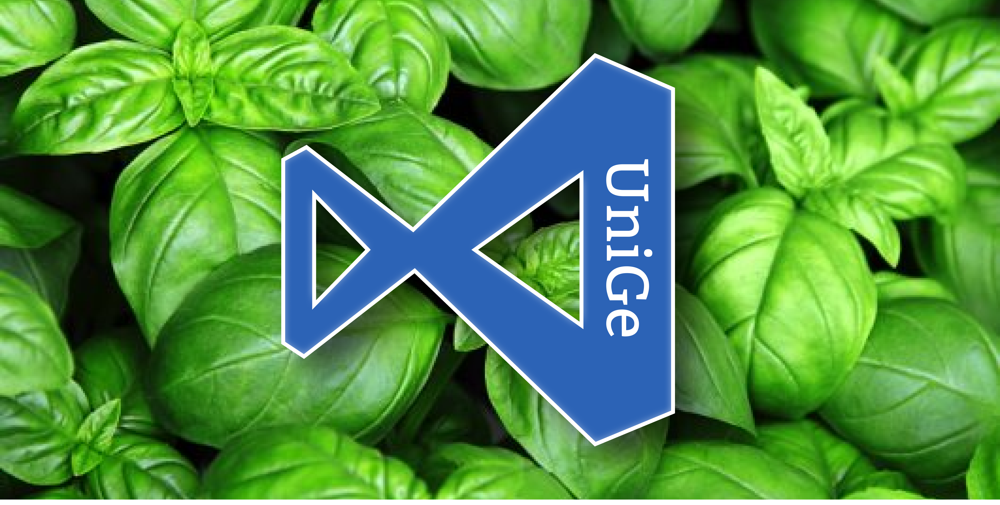

# UniGeCode

---
We are not the same, you study in room 210, we design icon packs.

## Supported file extensions

- .c
- .cpp
- .ipynb
- .java
- .m
- .ml
- .php
- .py
- .s
- .sh
- .txt

Vuoi farci una piccola donazione in cryptomonete?  
Ma perche' invece non esci di casa? Se ti piacciono cosi' tanto i database come dici, studiati la doc di [PostgreSQL](https://www.postgresql.org/docs/)

<a href="https://github.com/thaMilo">Milo Galli</a> ·
<a href="https://github.com/SamuelePignone">Samuele Pignone</a> ·
<a href="https://github.com/GiorgioRen">Giorgio Rengucci</a> ·
<a href="https://github.com/rcastellotti">Roberto Castellotti </a> 

